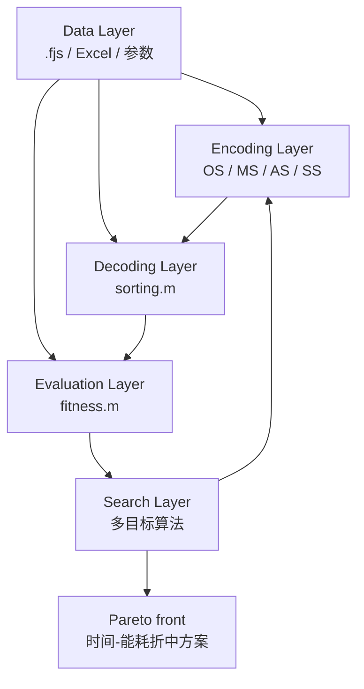

# FJSP-AGV 系统五层认知结构

## 核心问题

当前项目不是单一算法脚本，而是一个从实验数据到多目标搜索的调度优化系统。理解它最稳的方式，是把系统拆成五层：

1. Data Layer
2. Encoding Layer
3. Decoding Layer
4. Evaluation Layer
5. Search Layer

这五层回答的是同一个链条：**数据如何进入系统，如何变成决策，如何落成调度，如何被评价，如何被算法继续改进。**

## 五层结构

| 层 | 解决什么问题 | 核心模块/数据 | 输出给下一层什么 |
|---|---|---|---|
| Data Layer | 系统吃什么数据？ | `.fjs`、机器 Excel、AGV Excel、距离矩阵、能耗参数、实验参数 | `jobInfo`、`candidateMachine`、`distance_matrix`、`machineEnergy`、`AGVEnergy` |
| Encoding Layer | 用什么形式表达调度决策？ | `OS / MS / AS / SS` 染色体 | 一条可被解码的调度决策向量 |
| Decoding Layer | 决策如何变成真实调度过程？ | `sorting.m`、`machineTable`、`AGVTable`、`agvEGRecord` | 机器时间轴、AGV 时间轴、电量变化、卸载完成时间 |
| Evaluation Layer | 如何判断方案好不好？ | `fitness.m`、makespan、machine energy、AGV energy | 目标值 `[makespan, total energy]` |
| Search Layer | 如何找到更好的方案？ | NSGA-II、INSGA-II、MOEA/D、MOSSA、MOPSO | 新一代染色体、Pareto 解集 |

## 系统关系图

## 层与层如何连接

### Data -> Encoding

`.fjs` 提供工件、工序、候选机器和加工时间。编码层据此知道染色体长度、每个 `MS` 位置的合法机器范围，以及每个工件应该出现多少次。

### Encoding -> Decoding

染色体只表达决策，不直接等于甘特图。`sorting.m` 把 `OS / MS / AS / SS` 解释成工序顺序、机器选择、AGV 分配和速度选择。

### Decoding -> Evaluation

`sorting.m` 输出真实时间轴。`fitness.m` 不凭空算目标值，而是基于 `machineTable`、`AGVTable`、`jobCompleteUnLoad`、`agvEGRecord` 计算完工时间和能耗。

### Evaluation -> Search

算法只关心一个染色体的目标值是否更好。`fitness.m` 把复杂调度过程压缩成 `[makespan, total energy]`，供非支配排序、Pareto 选择和迭代更新使用。

## 为什么这种分层重要

- 它把“数据是什么”和“算法怎么搜”分开，便于论文描述实验输入。
- 它把“染色体表达决策”和“真实调度如何发生”分开，便于解释编码/解码设计。
- 它把“调度运行过程”和“方案好坏评价”分开，便于复现 makespan 与能耗计算。
- 它让复杂科研代码不再是一团脚本，而是可解释、可测试、可复现的系统。

## 核心认知

- optimization 本质是在搜索更优调度决策。
- `sorting.m` 决定系统如何运行。
- `fitness.m` 决定系统如何评价好坏。
- Pareto front 本质是多个目标之间的 trade-off，而不是单一最优点。

