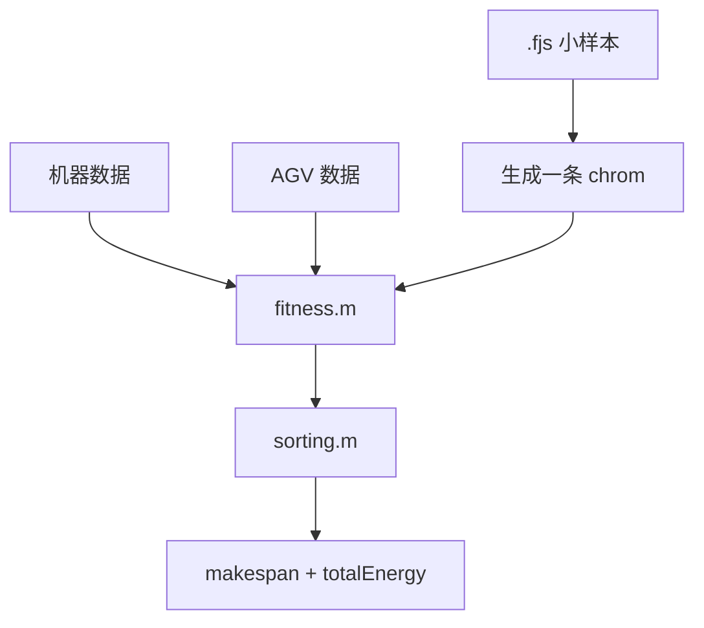

# 复现与封装路线：遇到问题时怎么办

## 1. 先说结论

复现和封装不是一上来重构全部算法，而是先把最短链路稳定下来：

```text
读数据
-> 生成一个染色体
-> 用 fitness 评价这个染色体
-> 得到 makespan 和 energy
```

这条链路稳了，再去整理算法、实验、画图和指标。

## 2. 为什么不能直接大改

当前 MATLAB 代码有几个特点：

- 主脚本里同时做了读数据、设参数、跑算法、画图、写结果。
- 很多路径依赖当前工作目录。
- 有些函数会自动写文件。
- 多个算法目录里有重复的 `fitness.m`、`sorting.m` 等函数。
- 随机过程没有统一 seed。

所以后期封装的原则是：

```text
先固定输入输出，再拆函数。
先验证小链路，再跑完整实验。
```

## 3. 复现风险与解决方案

| 问题 | 当前表现 | 复现时怎么办 | 后期封装方案 |
|---|---|---|---|
| `data.mat` 不知道从哪来 | `benchmarkRead.m` 读取 `.fjs` 后自动保存 | 运行前确认当前目录下 `data.mat` 是由哪个 `.fjs` 生成的 | 使用 `read_fjsp.m` 返回 `problem`，不再依赖 `data.mat` |
| Excel 被改写 | `distance_from_xy.m` 会写回 `机器数据.xlsx` | 运行前备份原 Excel，或先不调用距离回写逻辑 | 距离计算函数只返回矩阵，输出写到 `outputs/` |
| 路径错 | 代码里有 `cd('NSGA-II')`、`xlsread('机器数据.xlsx')` | MATLAB 当前目录必须在 `raw_code` 或脚本预期目录 | 用 `projectRoot` 和 `fullfile` 拼路径，不依赖手动 `cd` |
| 每次结果不同 | `rand`、`randperm`、`randn` 未固定 | 记录每次运行时间和参数，不要只保存最终图 | 每次实验开头设置并保存 `rng(seed)` |
| 输出混在一起 | `results.txt` 追加写，图名固定 | 每次运行前备份旧结果或清楚知道会追加 | 每次实验建立独立 `outputs/实验名/` 目录 |
| 参数分散 | 主脚本和算法内部都写参数 | 复现实验时记录主脚本参数和算法内部默认值 | 用配置文件集中管理参数 |
| 函数名重复 | 多个算法目录都有 `fitness.m`、`sorting.m` | 当前跑哪个算法，就确认 MATLAB 当前路径在哪个目录 | 后期提取公共模型函数，算法只保留搜索逻辑 |

## 4. 推荐封装顺序

不要从算法主函数开始拆。推荐顺序如下。

### 第一步：数据读取稳定

目标：

```text
文件 -> MATLAB 结构体
```

已完成：

```text
src/data/read_fjsp.m
```

下一步可做：

```text
read_machine_data.m
read_agv_data.m
```

要求：

- 只读取，不跑算法。
- 只返回数据，不写文件。
- 文件路径从外部传入。

### 第二步：建立统一数据包

目标：

把分散变量整理成几个容易传递的结构：

```text
problem      工件、工序、候选机器、加工时间
machineData  距离矩阵、机器能耗
agvData      AGV 数量、速度、电量、能耗、充电参数
config       算法参数、随机种子、输出目录
```

这样后面函数不需要传一长串变量。

### 第三步：单个染色体评价

目标：

```text
给一条 chrom，稳定算出 [makespan, totalEnergy]
```

这是最关键的封装点。

因为所有算法最终都在反复做这件事：

```text
生成染色体 -> 评价染色体 -> 根据目标值筛选
```

建议先做一个测试：

```text
test_fitness_smoke.m
```

测试内容：

- 读取小样本。
- 生成一个小种群。
- 取第一条染色体。
- 调用 `fitness`。
- 确认输出两个非空数字。

### 第四步：初始化和变异合法性检查

目标：

确认 `init.m` 和 `variation.m` 生成的染色体不会让 `sorting.m` 索引越界。

重点检查：

- `OS` 中每个工件出现次数是否等于工序数。
- `MS` 是否超出 `candidateMachine` 范围。
- `AS` 是否在 `1...AGVNum` 内。
- `SS` 是否在 `1...speedNum` 内。

### 第五步：小参数跑通一个算法

目标：

不是追求论文结果，而是确认算法闭环能跑。

建议参数：

```text
pop = 10
max_gen = 2
seed = 固定值
```

输出只需要确认：

- `obj_matrix` 非空。
- `curve.min` 非空。
- 没有路径错误。
- 没有索引错误。

### 第六步：整理完整实验

等上面都稳定后，再整理：

- `dif_main.m` 算法对比实验。
- `same_main.m` 消融实验。
- HV / Spacing / C-metric / IGD。
- Pareto 图、迭代图、甘特图。
- `outputs/实验名/` 输出目录。

## 5. 暂时不要动什么

当前阶段不建议马上动：

- 不要重写 `sorting.m`。
- 不要重写 `fitness.m`。
- 不要同时合并所有算法目录。
- 不要一次性改 `dif_main.m` 和 `same_main.m`。
- 不要一边改路径、一边改算法逻辑。

原因：

```text
sorting 和 fitness 是系统核心，一旦改错，所有算法结果都会变。
```

正确做法是先写旁路函数和测试，确认新旧结果一致，再逐步替换。

## 6. 最小稳定链路

后续所有封装都围绕这条链路：



只要这条链路稳定，算法层就是在外面反复调用它。

## 7. 以后每次封装的检查清单

每拆一个模块，都问：

1. 它吃什么输入？
2. 它吐什么输出？
3. 它有没有写文件？
4. 它有没有依赖当前目录？
5. 它有没有随机过程？
6. 它有没有改变原始数据？
7. 有没有一个小测试能证明它没坏？

如果这七个问题答不清楚，就先不要继续往下拆。

## 8. 当前进度与下一步

当前 small / medium / formal 可复用运行骨架已经跑通。

后续已选择：

```text
路线 A：继续工程化
```

因此下一步不建议继续盲目放大参数，也不建议马上进入完整论文实验。

路线 A 已经推进到第 17 步：

```text
第 17 步：指标入口设计
```

已经完成：

```text
configs/formal_nsga2_config.m
tests/test_formal_nsga2_config.m
scripts/run_formal_nsga2.m
formal 手动跑通
docs/07_reproduction/reproduction_steps/17_metrics_entry_design.md
```

当前指标入口的最小读取版已经实现，并已由你在 MATLAB 中手动跑通。

当前已经新增：

```text
configs/formal_nsga2_config.m
```

它只负责保存 formal 配置，已经被 `scripts/run_formal_nsga2.m` 使用。

当前已经新增 formal 配置读取测试：

```text
tests/test_formal_nsga2_config.m
```

它只检查配置字段，不运行正式算法。

当前已经新增：

```text
scripts/run_formal_nsga2.m
```

它是 formal NSGA-II 的第一版运行骨架，已经由你在 MATLAB 中手动跑通。

formal 第一版已经手动跑通：

```text
run('scripts/run_formal_nsga2.m')
pop = 30
max_gen = 10
paretoSolutionCount = 2
bestMakespan = 134.446667
bestTotalEnergy = 1770.988667
outputDir = outputs/formal_nsga2/20260520_224558
```

第 17 步已经进入指标入口设计：

```text
scripts/run_metrics.m
```

当前已经新增 `scripts/run_metrics.m`。核心关系是：

```text
run_formal_nsga2.m -> 生成 formal_nsga2_result.mat
run_metrics.m      -> 读取 formal_nsga2_result.mat 并生成最小指标摘要
```

指标结果未来应保存到：

```text
outputs/formal_nsga2/时间戳/metrics/
```

`run_metrics.m` 已经由你在 MATLAB 中跑通：

```text
sourceRunDir = outputs/formal_nsga2/20260520_224558
paretoSolutionCount = 2
bestMakespan = 134.446667
bestTotalEnergy = 1770.988667
metricsDir = outputs/formal_nsga2/20260520_224558/metrics
```

因此第一阶段工程化闭环已经完成。当前不建议继续堆功能，下一条主线建议转向：

```text
编码-解码应用理解
```

也就是基于当前 FJSP-AGV 项目，整理“调度对象 -> 决策变量 -> 编码 -> 解码 -> 评价 -> 搜索”的可迁移理解框架。
